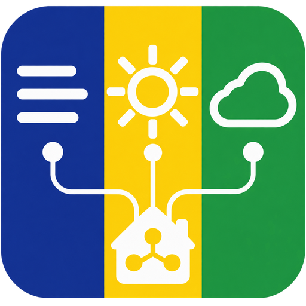

<p align="center">
  
</p>

<h1 align="center">Meteocat Weather per a Home Assistant</h1>

<p align="center">
  Observacions XEMA, predicció municipal i radar de pluja animat de Meteocat,<br>
  integrats amb les entitats natives de Home Assistant.
</p>

<p align="center">
  <a href="https://github.com/sabatesduran/meteocat-ha/releases/latest"></a>
  <a href="https://github.com/sabatesduran/meteocat-ha/actions/workflows/validate.yml"></a>
  <a href="https://github.com/sabatesduran/meteocat-ha/releases/latest"></a>
  <a href="LICENSE"></a>
</p>

> [!NOTE]
> Aquesta és una integració comunitària i no oficial. No entra en conflicte amb
> la integració `meteocat`, perquè utilitza el domini propi `meteocat_weather`.

## Què ofereix

| Component | Dades |
| --- | --- |
| **Temps** | Observacions actuals XEMA i predicció municipal horària i diària |
| **Sensors** | Temperatura, humitat, pressió, precipitació, vent, ratxa i hora de l'última observació |
| **Radar** | GIF animat de 30 o 60 minuts, centrat a la ubicació configurada |

- Predicció **horària de 72 hores** i **diària de 8 dies**.
- Selecció automàtica del municipi i de l'estació XEMA operativa més propers.
- Configuració íntegrament des de la interfície; no cal afegir YAML.
- Intervals conservadors adaptats a les quotes mensuals de Meteocat.
- Memòria cau de les últimes dades bones quan l'API o el radar no estan disponibles.
- Reautenticació, diagnòstics amb dades sensibles ocultes i traduccions en català,
  castellà i anglès.
- Entitats i targetes natives de Home Assistant, sense dependències de frontend.

## Requisits

- Home Assistant **2025.12** o posterior.
- Una clau de l'[API de Dades Meteorològiques de Meteocat][meteocat-api].
- Accés als plans **XEMA** i **Predicció** per a aquesta clau.
- Connexió a Internet per consultar l'API i les tessel·les del radar.

El radar utilitza les tessel·les públiques oficials i **no consumeix quota de
l'API**. Aquest recurs no forma part de l'API REST documentada i pot deixar de
funcionar temporalment si Meteocat en modifica el format o les rutes.

## Instal·lació

### HACS, recomanat

[](https://my.home-assistant.io/redirect/hacs_repository/?owner=sabatesduran&repository=meteocat-ha&category=integration)

Si el botó no funciona:

1. A HACS, obre **Integracions**.
2. Obre el menú de tres punts i selecciona **Repositoris personalitzats**.
3. Afegeix `https://github.com/sabatesduran/meteocat-ha` com a tipus
   **Integració**.
4. Cerca i instal·la **Meteocat Weather**.
5. Reinicia Home Assistant.

### Instal·lació manual

1. Descarrega `meteocat_weather.zip` des de l'[última versió publicada][release].
2. Crea la carpeta `config/custom_components/meteocat_weather`.
3. Extreu-hi el contingut del ZIP.
4. Reinicia Home Assistant.

L'estructura final ha de contenir aquest fitxer:

```text
config/custom_components/meteocat_weather/manifest.json
```

## Primera configuració

1. Ves a **Configuració → Dispositius i serveis → Afegeix integració**.
2. Cerca **Meteocat Weather**.
3. Introdueix la clau API. Les coordenades apareixen emplenades amb la ubicació
   de Home Assistant i serveixen per centrar el radar i ordenar les estacions.
4. Prem **Següent** perquè la integració validi la clau i consulti les fonts
   disponibles.
5. Confirma o canvia el **municipi de la predicció** i l'**estació XEMA
   d'observació**.

El municipi i l'estació són independents: pots utilitzar la predicció d'un
municipi i les observacions d'una estació propera diferent.

## Entitats creades

La integració agrupa totes les entitats en un únic dispositiu de Meteocat.
Els identificadors exactes depenen del municipi, l'idioma i els noms existents a
la teva instància.

| Plataforma | Entitat | Disponibilitat |
| --- | --- | --- |
| `weather` | Observacions actuals, predicció horària i predicció diària | Sempre |
| `camera` | Radar de pluja animat | Sempre; la primera càrrega pot trigar uns segons |
| `sensor` | Temperatura | Si l'estació publica la variable XEMA 32 |
| `sensor` | Humitat relativa | Si l'estació publica la variable XEMA 33 |
| `sensor` | Pressió atmosfèrica | Si l'estació publica la variable XEMA 34 |
| `sensor` | Precipitació | Si l'estació publica la variable XEMA 35 |
| `sensor` | Velocitat i direcció del vent | Si l'estació publica les variables XEMA 30 i 31 |
| `sensor` | Ratxa de vent | Si l'estació publica la variable XEMA 50 |
| `sensor` | Última observació | Quan hi ha lectures amb data disponible |

És normal que algunes estacions no creïn tots els sensors: la integració només
afegeix les variables que l'estació seleccionada publica.

## Quotes i freqüència d'actualització

La integració consulta el consum del compte durant la configuració i reserva un
**20% de marge** per a reintents, canvis d'opcions i reinicis de Home Assistant.

| Servei | Pla habitual | Interval | Consum periòdic màxim en 31 dies |
| --- | ---: | ---: | ---: |
| Observacions XEMA | 750 consultes/mes | 90 minuts | 496 consultes |
| Predicció | 100 consultes/mes | 24 hores | 62 consultes |
| Radar públic | Sense quota API | 6 minuts | 0 consultes API |

Cada actualització de predicció fa dues consultes: una per a la predicció
horària i una altra per a la diària. Per això no s'ofereixen intervals de 6 o 12
hores amb el pla de 100 consultes. XEMA també es limita a un mínim de 90 minuts;
60 minuts deixaria massa poc marge en mesos de 31 dies.

## Opcions

Obre **Configuració → Dispositius i serveis → Meteocat Weather → Configura** per
canviar aquests valors:

| Opció | Valors | Predeterminat |
| --- | --- | --- |
| Coordenades del radar | Latitud i longitud dins de Catalunya | Ubicació de Home Assistant |
| Municipi de la predicció | Municipis disponibles a l'API | Més proper |
| Estació d'observació | Estacions XEMA operatives | Més propera |
| Actualització XEMA | 90 o 180 minuts | 90 minuts |
| Actualització de predicció | 24 hores | 24 hores |
| Cobertura del radar | Catalunya o local | Local |
| Historial del radar | 30 o 60 minuts | 60 minuts |

En desar les opcions, Home Assistant recarrega la integració automàticament.

## Targetes del tauler

No cal instal·lar cap targeta personalitzada. També pots afegir-les amb l'editor
visual de Home Assistant i seleccionar les entitats creades per la integració.

### Predicció horària

```yaml
type: weather-forecast
entity: weather.meteocat_weather
forecast_type: hourly
show_forecast: true
```

Canvia `forecast_type` a `daily` per mostrar la predicció diària.

### Radar animat

```yaml
type: picture-entity
entity: camera.meteocat_radar_de_pluja
camera_view: live
show_name: true
show_state: false
```

Substitueix els identificadors dels exemples pels de la teva instància. El
primer GIF pot trigar uns segons perquè ha de descarregar i compondre els
fotogrames; després es reutilitzen el mapa base i les tessel·les en memòria cau.

## Problemes habituals

| Símptoma | Què cal comprovar |
| --- | --- |
| **La clau no és vàlida o falta un pla** | Confirma al portal de Meteocat que la clau té els plans XEMA i Predicció actius |
| **Quota exhaurida** | Consulta el consum al portal i espera que es renovi el període mensual |
| **Falta un sensor** | Comprova si l'estació escollida mesura aquesta variable; prova una altra estació |
| **El radar no apareix** | Espera la primera composició, comprova la connexió i revisa que l'entitat de càmera estigui habilitada |
| **Les dades no canvien** | Revisa l'hora d'«Última observació»; algunes estacions publiquen amb retard |
| **No apareix després d'instal·lar** | Reinicia Home Assistant i neteja la memòria cau del navegador |

Quan una actualització falla després d'haver obtingut dades correctes, la
integració conserva les últimes dades disponibles en lloc de buidar les
entitats.

### Registre de depuració

Per activar temporalment els logs detallats, afegeix això a
`configuration.yaml` i reinicia Home Assistant:

```yaml
logger:
  logs:
    custom_components.meteocat_weather: debug
```

No publiquis mai la clau API en una incidència. Si adjuntes els diagnòstics de
Home Assistant, la integració hi elimina automàticament la clau i les coordenades
exactes.

## Actualitzacions

HACS avisarà quan hi hagi una versió nova. Després d'actualitzar la integració,
reinicia Home Assistant. Pots consultar tots els canvis al [Changelog](CHANGELOG.md).

## Desenvolupament

```bash
python -m pip install aiohttp pytest pytest-asyncio ruff
ruff check .
ruff format --check .
pytest
python -m compileall -q custom_components
```

La CI també executa proves contra la versió de Home Assistant fixada al
workflow, a més de les validacions de HACS i Hassfest. Les proves unitàries no
necessiten cap clau API i utilitzen respostes simulades.

Les contribucions són benvingudes. Abans d'obrir una pull request, consulta
[CONTRIBUTING.md](CONTRIBUTING.md). Per informar d'un problema, obre una
[incidència a GitHub][issues] i adjunta els logs rellevants sense dades sensibles.

## Fonts, atribució i llicència

Dades del [Servei Meteorològic de Catalunya (Meteocat)](https://www.meteo.cat/).
Aquest projecte no és un producte oficial del Servei Meteorològic de Catalunya
ni de la Generalitat de Catalunya.

El codi es distribueix sota l'[Apache License 2.0](LICENSE).

[issues]: https://github.com/sabatesduran/meteocat-ha/issues
[meteocat-api]: https://apidocs.meteocat.gencat.cat/
[release]: https://github.com/sabatesduran/meteocat-ha/releases/latest
